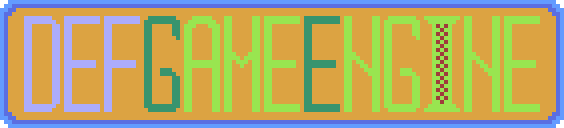

<p align="center"></p>

# Overview

defGameEngine is a lightweight, cross-platform (Windows, Linux, macOS, Web) 2D game engine designed for simplicity and ease of use. It provides essential tools for rendering graphics and handling input. The engine supports both desktop (via GLFW) and web (via Emscripten) platforms.

# Features

- Windows, Linux, macOS, and web browsers support.
- Draw shapes, sprites, textures and text with various blending modes.
- Handle keyboard, mouse and touch input (web).
- Load, manipulate and render fully rotated and scaled images via sprites and textures.
- Organise rendering into layers with custom shaders.
- Handle window (resize, enable fullscreen mode, VSync)

## Getting Started

Start instantly reading [this](https://deepwiki.com/defGameEngine/defGameEngine) or proceed with the docs written by me.

Follow the [install instructions](/README.md#installation), clone this repository and start exploring the code and examples. Check out the [Examples repository](https://github.com/defGameEngine/Examples) for a comprehensive set of already made demos using the game engine.

Important, clone recursivelly:
```bash
git clone --recurse-submodules https://github.com/defGameEngine/defGameEngine.git
```

## Installation

### Platforms

- [Windows](Docs/Install_Instructions_Windows.md)
- [Linux](Docs/Install_Instructions_Linux.md)
- [Mac](Docs/Install_Instructions_Mac.md)
- [Emscripten](Docs/Install_Instructions_Emscripten.md)

****Note**:* C++20 or higher is required

## Documentation

1. Generated by DeepWiki [one](https://deepwiki.com/defGameEngine/defGameEngine)
1. Not fully written yet by myself is [here](Docs/GameEngine_Doc.md)

## Online demos

1. [Raycaster](https://defini7.itch.io/defgameengine-raycaster)
2. [Minesweeper](https://defini7.github.io/demos/minesweeperai)
